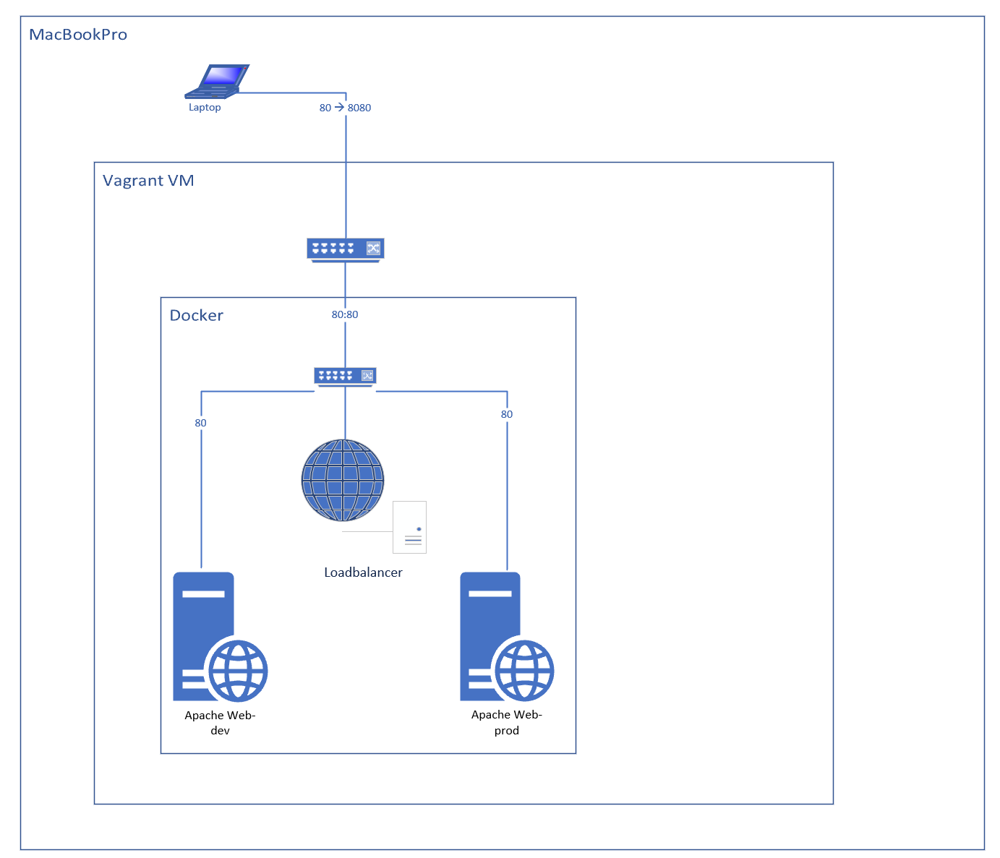

### Dokumentation LB2
## Inhaltsverzeichnis
- [1. Einleitung](#1-einleitung)
  - [1.1 Verwendung](#11-verwendung)
- [2. Voraussetzungen](#2-voraussetzungen)
- [3. Beschreibung der Umgebung](#3-beschreibung-der-umgebung)
- [4. Vorgehen](#4-vorgehen)
- [5. Testen](#5-testen)
- [6. Quellenverzeichnis](#6-quellenverzeichnis)

# 1. Einleitung

Im Modul 300 wird im Umfang der LB2 ein Projekt mit Docker Umgesetzt. Der Service besteht aus 2 Webservern, welche eine Unterschiedliche Website anzeigen. Davor wird ein Nginx LoadBalancer geschaltet, der Anfragen vom Host auf [Localhost:8080](localhost:8080) beantwortet. Die einzelnen Webserver sind nicht mehr direkt erreichbar. Die Webserver werden mit Docker ```Compose up --build -d``` gestartet.

## 1.1 Verwendung

Nchdem pullen des Repositorys muss der eigene Public-Key in das ```scripts/add_ssh_pb.sh``` File hinzugefügt werden. Jetzt kann im Arbeitsverzeichnis ```vagrant up``` ausgeführt werden, was die VM startet. Nun kann auf die VM verbunden werden, z.B. mit Bitvise oder Vagrant ssh. In der VM selbst muss man ins ```/mnt``` Verzeichnis navigieren mit ```cd /mnt``` und dort dann ```Compose up --build -d``` ausführen. Nun sind die Webserver gestartet und der LoadBalancer ist über [Localhost:8080](localhost:8080) erreichbar.

# 2. Voraussetzungen

Vom Github repository [aiannelli/LB2](https://github.com/aiannelli-tbz/LB2) können dan alle Daten bezogen werden.
Als Basis dafür wird ein Vagrant File aus einer vorherigen [Aufgabe](https://gitlab.com/mbe99/docker-work) verwendet. Diese VM verfügt bereits über einen shared Folder und Port weiterleitungen darunter auch ```80 --> 8080```. Auch ist Docker bereits installiert. Um die VM zu Starten muss im Arbeitsverzeichnis ```vagrant up``` ausgeführt werden.

# 3. Beschreibung der Umgebung

Die Umgebung besteht aus 3 Docker Containern. 2 Webservern und einem LoadBalancer. Die Webserver sind mit Apache2 auf port 80 mit dem inetrenen Docker-Netzwerk verbunden. Der LoadBalancer ist mit Nginx aufgesetzt. Die Webserver sind nicht direkt erreichbar, sondern nur über den LoadBalancer. Der LoadBalancer ist vom Host aus über den Port 8080 erreichbar.


# 4. Vorgehen 

Zuerst musste ich meine Umgebung von Gitlab zu Github migrieren, da die VM die ich verwendete aus einem Beispiel auf Gitlab stammte. Dafür musste ich das .git Verzeichnis Löschen und dann nach Github pushen.

Anschliessend, begann ich damit mein **Dockerfiile** für Apache zu erstellen. 
```Dockerfile	
FROM httpd:latest
EXPOSE 80
```
Dieses **Dockerfile** ist sehr simpel, es basiert auf dem neusten Apache Image und öffnet den Port 80. Anschliessend habe ich das **Dockerfile** für den Nginx LoadBalancer erstellt.
```Dockerfile
FROM nginx:latest

RUN rm /etc/nginx/conf.d/default.conf

COPY nginx.conf /etc/nginx/conf.d/
```
Dieses **Dockerfile** basiert auf dem neusten Nginx Image. Es löscht die default.conf und fügt die eigene **nginx.conf** hinzu. Diese sieht wie folgt aus:
```nginx.conf
upstream backend {
    server web_dev:80;
    server web_prod:80;
}

server {
    listen 80;

    location / {
        proxy_pass http://backend;
        proxy_set_header Host $host;
        proxy_set_header X-Real-IP $remote_addr;
        proxy_set_header X-Forwarded-For $proxy_add_x_forwarded_for;
        proxy_set_header X-Forwarded-Proto $scheme;
    }
}
```
Diese Konfiguration leitet alle Anfragen an den LoadBalancer an die beiden Webserver weiter. Die Webserver sind über das interne Docker-Netzwerk erreichbar. Der LoadBalancer ist über den Port 80 erreichbar.

Um all diese Container zu starten, habe ich dann ein **Docker Compose File** erstellt.
```docker-compose.yml
version: '1-0'
services:
  web_dev:
    ports:
      - "80" 
    volumes:
      - /mnt/apache/dev/:/usr/local/apache2/htdocs/
    build: ./dev/
    limit:
        cpus: 0.1
        memory: 50M

  web_prod:
    ports:
      - "8081"  
    volumes:
      - /mnt/apache/prod/:/usr/local/apache2/htdocs/
    build: ./prod/
    limit:
        cpus: 0.1
        memory: 50M

  load_balancer:
    build:
      context: ./nginx/
      
      limit:
        cpus: 0.1
        memory: 50M
    ports:
      - "80:80"  
```
In diesem **Docker compose** file werden alle drei Container konfiguriert.
Für die beiden Webserver werden Ports freigegeben und die HTMl Files werden in die Ordner gemountet. Die einzelnen Dockerfiles werden mit ```build: ``` angegeben. Auch werden Hardware-Limits definiert, welche die Container daran hindern zu viel Ressourcen zu verbrauchen.

# 5. Testen
Um zu sehen ob alles funktioniert, habe ich die Webserver mit ```docker-compose up --build -d``` gestartet. Anschliessend habe ich mit ```docker ps``` überprüft ob alle Container laufen. Nun habe ich den LoadBalancer über [Localhost:8080](localhost:8080) aufgerufen. Es wurde abwechslungsweise die Website der beiden Webserver angezeigt. Somit funktioniert der LoadBalancer.

# 6. Quellenverzeichnis
- [Docker Compose](https://docs.docker.com/compose/)
  [ChatGPT](chat.openai.com)
- [Docker](https://www.docker.com/)
- [Pinboard](https://docs.google.com/document/d/1I3lii57bxGt3mrPt09S1-F_iWeBVa-IDNCXgo1iofzU/edit)